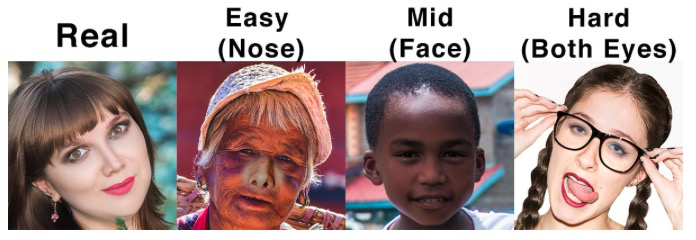
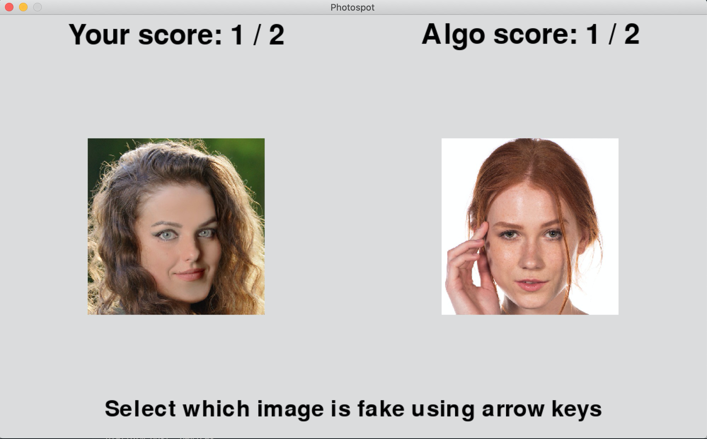

# Fake vs Real Face Detection
## Project Intro/Objective
The purpose of this project was to develop a classifier to detect fake images of faces. 

### Methods Used
* Machine Learning
* Convolutional Neural Networks

### Technologies
* Python
* jupyter
* Tensorflow (incl. Tensorboard)
* Sklearn 

## Project Structure

1. Raw Data is kept [here](./data/raw) within this repo
2. Some python scripts are [here](./src)
3. Notebooks are kept [here](./notebooks)
4. A demo of the project constructured as a game is kept [here](./demo)

## Featured Notebooks/Analysis/Deliverables
Analysis was carried out in jupyter notebooks, there were three main notebooks covering EDA, Training, and Evaluation. 

1. [EDA/ Data Visualisation](./notebooks/EDA.ipynb)
2. [Original Training Notebook](./notebooks/Training.ipynb)
3. [Evaluation Notebook](./notebooks/Evaluation.ipynb)
4. [Training Notebook (with pre-training on the labelled faces in the wild dataset)](./notebooks/training_w_LFW.ipynb)

As a bonus I tried to to pre train a model using a synthetically generated dataset created using face-swapping on the [labelled faces in the wild (lfw)](http://vis-www.cs.umass.edu/lfw/) dataset. To create this supplementary dataset I used a modified version of the [FaceSwap app](https://github.com/MarekKowalski/FaceSwap) to perform random swaps between faces in the lfw dataset. The idea was to pre-train a model on this dataset and then refine the model to work with the original fake vs real dataset. As the fakes generated by FaceSwap were of much lower quality than in the fake vs real dataset my model was able to quite accurately categorise them. However it was not able to transfer this knowledge to the fake vs real dataset, implying that the underlying distributions are to distinct to enable transfer learning. This work is contained in [fourth](./notebooks/Training_w_LFW.ipynb) notebook.

## Data

I found the dataset for this project on [kaggle](https://www.kaggle.com/ciplab/real-and-fake-face-detection) it consists of 2000 images of fake and real images (split roughly 50/50). The fake images are split into three categories (easy, medium and hard) and are also broken down by which part of the image had been photoshopped: left eye, right eye, mouth and nose or any combination of these 4.

Below is a selection of the dataset:

## Game

In order to showcase my model and 'deploy' it I made a game where the player is presented with two pictures, one of which is photoshopped and one which is not. They then must guess which is the fake one. Once the player has made their selection the image is fed into the trained model which also makes a prediction. The aim is to try and get more correct than the algorithm. To play the game clone my github repo and run the script [`/demo/demo.py`](./demo/demo.py).

Screenshot of game:

## Contact
* If you want to contact me - reach out to me on [LinkedIn](www.linkedin.com/in/rees) or send me an email
